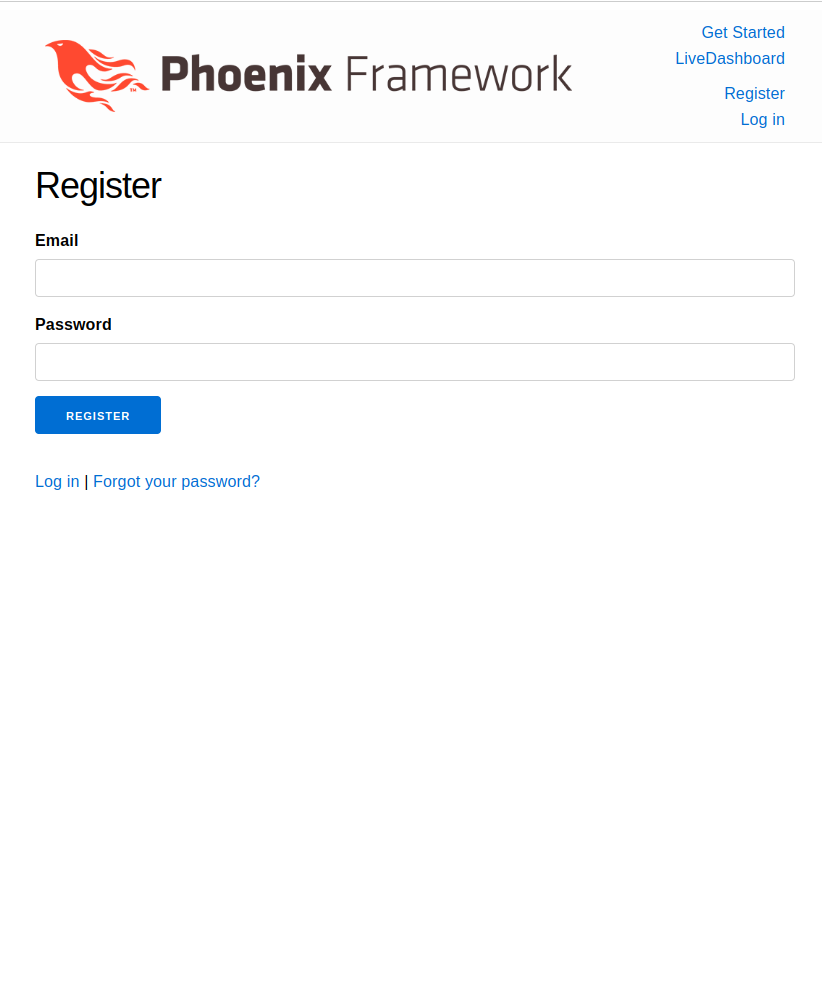
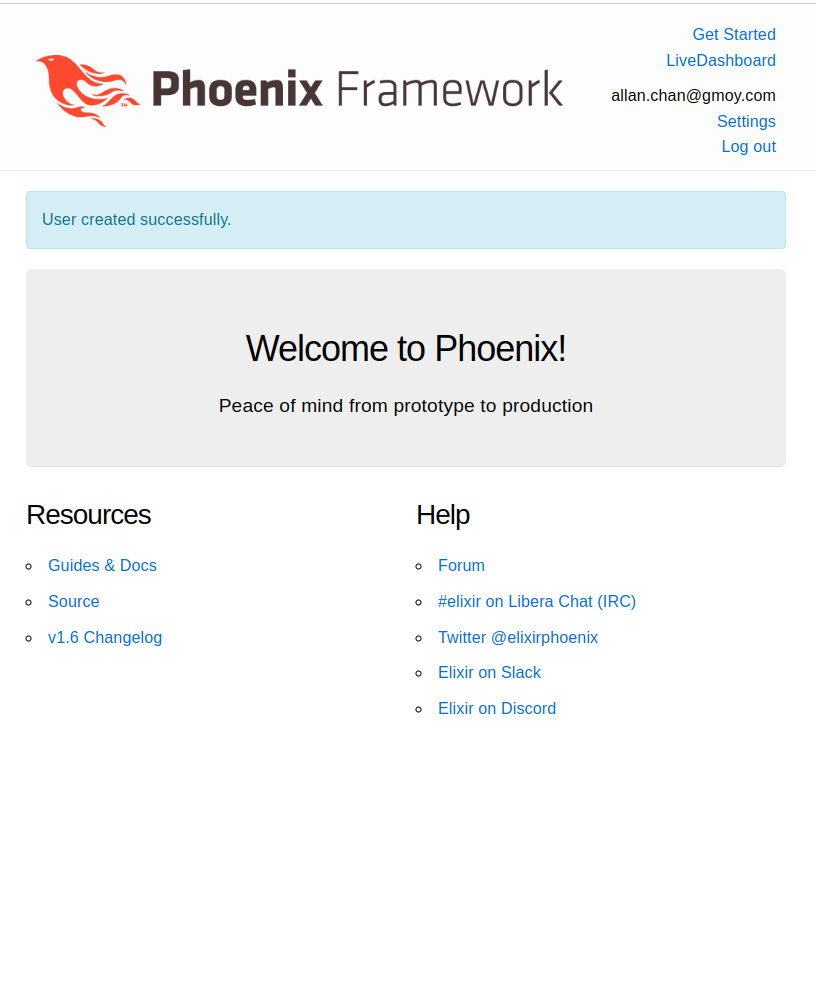
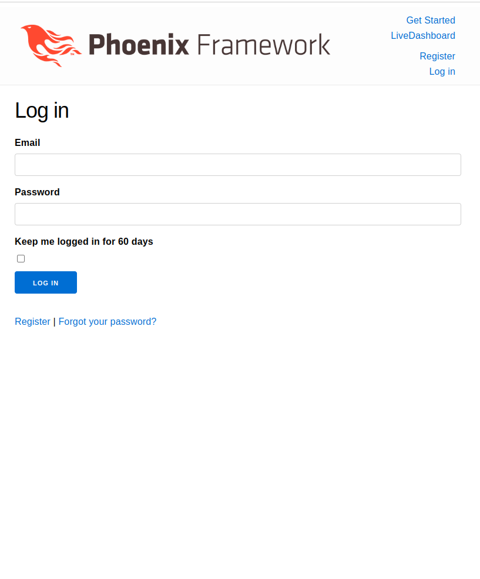
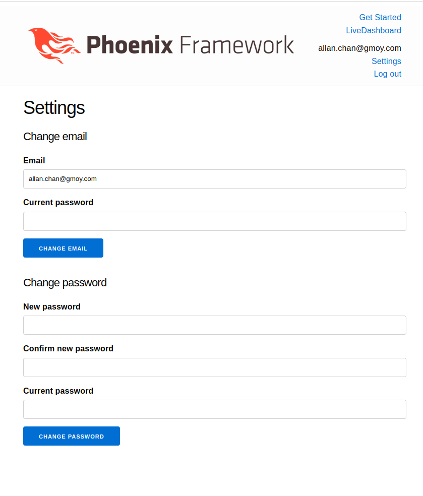
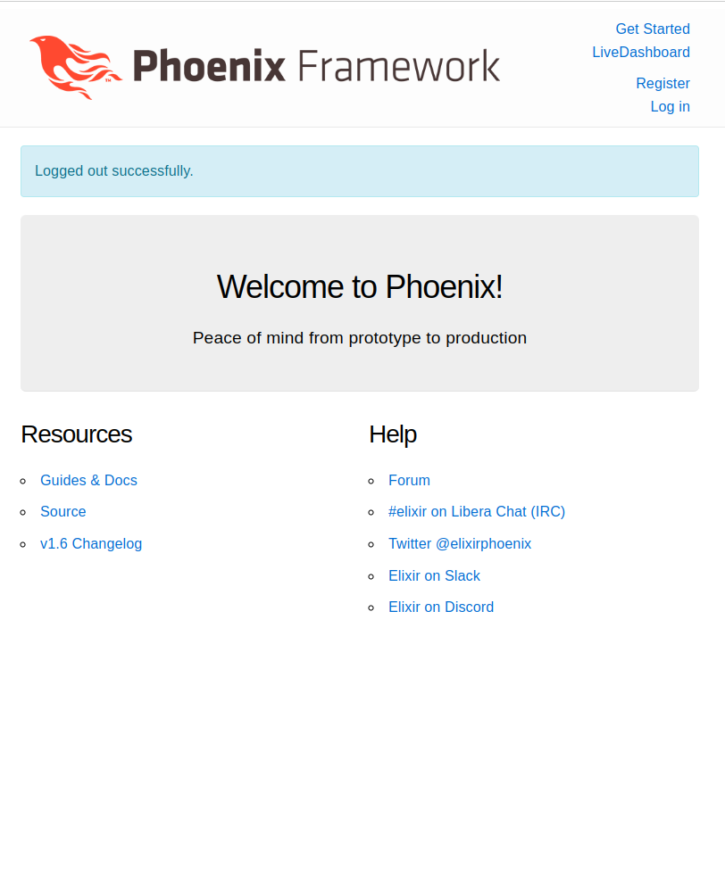

# Authenticator

This is a demostration of using phx.gen.auth for user authentication

## To get started

Start by running the following command from the root of the app:

$ mix phx.gen.auth Accounts User users

Additional dependencies in mix.exs, let's fetch those:

$ mix deps.get

Then run the following to create the database:

$ mix ecto.setup

Run the tests to make sure our new authentication system works as expected.

$ mix test

Finally, start Phoenix server and try it out.

$ mix phx.server

## Screenshot

